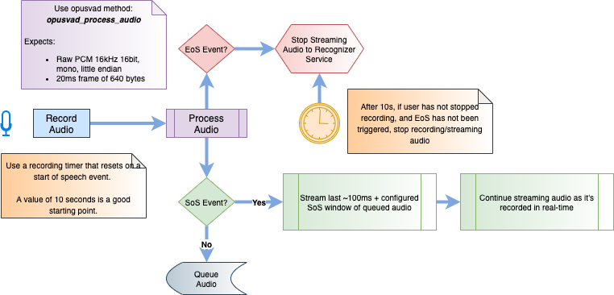

# Developer Guide

The following Developer Guide provides instruction on installing, validating,
and using Nuance's opusvad library for processing streaming PCM audio and capturing
Voice Activity Detection (VAD) events.

## Introduction

`opusvad` is a library that implements speech-endpointing on raw PCM audio streams. The library consists of two core components:

* libopus, an open-source audio encoder/decoder available on [github](https://github.com/xiph/opus)
* libopusvad, a small c library implemented by Nuance that wraps the libopus encoder and VAD module, providing clients with an API for:
  *  capturing start and end of speech events in the audio stream
  *  tuning the encoder and endpointer algorithms
  *  using the opus encoded audio for streaming to Nuance's ASR services
  *  support for adpcm audio streams
* libopusvadjava, a small c library similar to libopusvad but also including a JNI layer
* COPYING.md, a reproduction of the Opus license [here](https://github.com/xiph/opus/blob/master/COPYING)

### Why Use opusvad?

Leveraging Voice Activity Detection and end-pointing on the audio stream allows for:

**An Optimized User Experience**

Client devices can provide visual cues and timely feedback to the user showing them that the system hears them and is listening

**An Increase in Transactional Success Rates**

Only stream audio to the speech recognition service when there is a high degree of confidence that the audio conains speech. This will improve overall transactional success rates and provide a better measure of true recognition performance and accuracy.

**Reduced Operational Costs**

Some solution domains like IoT and DTV often see upwards of 50% of requests that are inadvertant or false starts by the end user, and a speech recognition request was actually never intended. For example, we've seen with TV solutions using a speech-enabled remote control that upwards of 40% of requests can be inadvertant button presses and the user never intended to speak. Blocking these requests at the client can help to significantly reduce server-side provisioning costs

### Why libopus for VAD?

**What is Opus?**

* Opus is developed with the intent of being a royalty free, highly versatile audio codec.
* Opus is the industry gold standard for interactive speech and audio transmission over the internet
* It is standardized by the Internet Engineering Task Force (IETF) as RFC 6716

You can find additional information on the Opus codec [here](http://opus-codec.org)

Source code for libopus can be found on github [here](https://github.com/xiph/opus)

**What is Opus VAD?**

Opus includes a Voice Activitiy Detection (VAD) module providing audio classification as audio packets are passed through the Opus Encoder.

The Opus VAD module has been proven to perform extremely well with

    * classifying noise within the speech spectrum 
    * classifying speech frames as either voiced or unvoiced

The Nuance `opusvad` library uses this audio classification feature as the basis of a speech endpointing library. Applying some windowing to the audio classification, `opusvad` provides a simple API for detecting start and end of speech events which can then be used to manage the user experience and interaction with recognition services.

And because the raw pcm audio has been encoded to opus to generate the VAD classifications, the client can take advantage of streaming this high-performant compressed audio to Nuance's recognizer service to reduce network bandwidth requirements.

### Library Performance

The opusvad library has been tested and considered compatible with linux, Mac, Android, iOS, JNI Java, Windows and dotnet.

* The library has been tested with the following audio formats:
    * 16kHz 16bit signed little-endian PCM mono
    * 16kHz 4bit IMA-ADPCM mono

* The VAD library is designed to use the Opus Library in "narrowband", so CPU usage fits roughly 40MHz or 2% of a 2GHz capturing
    * For PCM file processing the total instructions used were about 30 MHz of CPU usage
    * When processing the same audio files in ADPCM format the total instructions used were 60 MHz of CPU usage
* CPU utilization is ~.02 seconds per 1 second of audio
* Memory utilization requires a maximum of 50KB per core

* The footprint when built for Ubuntu with optimization -O0 is as follows:

|   text  |  data  |   bss  |  filename
|---------|--------|--------|-----------------------------------------------------------------
| 338679  |  2156  |   320  |  opusvadtool    (statically linked tool) 
| 372017  |  2240  |     8  |  libopus.so     (patched opus library)
| 12367   |  660   |    16  |  libopusvad.so  (VAD wrapper library)


In addition, here are links to the Opus codec specification that detail it's computational requirements:

* Operating Space: https://tools.ietf.org/html/rfc6366#section-5.1
* Computational Resources: https://tools.ietf.org/html/rfc6366#section-5.4
* Voice Activity Detection: https://tools.ietf.org/html/rfc6716#section-5.2.3.1
* Opus FAQ: https://wiki.xiph.org/OpusFAQ

## Getting Started

To get started using `opusvad` in your projects, you'll need to:
* download and build the `opusvad` library for your target platform
* design your application to use `opusvad` as part of your audio stream processing

The following sections describe 
* what's in the package we provide
* building and installing opusvad
* Using opusvad in your client application

### Package Overview

The package that Nuance provides contains the following:
* shell `scripts` to help automate building the libraries and test apps
* opus.patch - a patch file applied against libopus to expose the VAD module
* [src](#src) - this folder contains the core opusvad library that you'll use in your applications
* [java](#java) - this folder contains a project that builds with maven creating a jar file that includes all the various platfrom distributions (except android and ios)
* [samples/C](#samples/C) - this folder contains an example of how to use the opusvad library to process audio in 'C'
* [samples/java](#samples/java) - this folder contains an example of how to use the opusvadjava JNI layer to process audio in Java
### Scripts

The `opus-vad` package includes the following scripts in libopus-build-scripts:

* mac.sh
* ubuntu.sh
* centos.sh
* android.sh
* ios.sh

Use these scripts to:

* review dependencies
* automate the building and compiling of libopus and opusvad
* build and run the sample clients for your target platform

It's recommended to start with one of these scripts before proceeding further into the package sub-folders.

### src

If you're interested in understanding how opusvad works, modifying how the library works, or need to compile and build for a platform not already covered by one of the build scripts provided, then this is where you want to start.

The key files you wants to explore are:

* opusvad.h
* opusvad.c
* opusvadjava.c

To build the library, run the appropriate build script for your platform:
**osx**
```shell
(libopus-build-scripts)$ ./mac.sh 
```

### samples C

`opusvadtool` provides a simple client written in c illustrating how to use the opusvad library. All of the code can be found in:

* opusvadtool.c

To build the tool, run:

> set OPUS_VERSION = 1.3.1

**`opusvadtool` usage details**

```shell
./opusvadtool -h
Usage: ./opusvadtool [-h] -f <infile> [-s sos] [-e eos] [-c complexity] [-b bit_rate_type] [-t speech sensitivity threshold] [-a] [-n]
Input file must be 16000 Hz 16 bit signed little-endian PCM mono
If <infile> is "-", input is read from standard input
-s       start of speech window in ms. Default: 220
-e       end of speech window in ms. Default: 900
-c       opus vad encoding complexity level (0-10). Default: 3
-b       opus vad bit rate type (0 = VBR, 1 = CVBR, 2 = CBR). Default: 1
-t       speech detection sensitivity parameter (0-100). Specify 0 for least sensitivity, 100 for most. Default: 20
-a       <infile> is treated as IMA-ADPCM 4bit 16kHz
-n       specify high-nibble order for adpcm encoded <infile>
Examples:
        sox in.wav -r 16000 -b 16 -e signed -L -c 1 -t raw - | ./opusvadtool -f - -e 400
        sox in.wav -t ima -e ima-adpcm -r 16000 -c 1 - | ./opusvadtool -f -a
        sox in.wav -t ima -e ima-adpcm -r 16000 -c 1 -N - | ./opusvadtool -f - -a -n
        sox in.wav -r 16000 -b 16 -e signed -L -c 1 -t raw - | ./opusvadtool -f - -t 30 -e 700
```

**example**

```shell
/opusvadtool -f in.pcm
[eba43354-06de-45c1-b819-585ac2584855] sos: 336ms
Time: 0.0400 seconds
```
### java

`java` provides a simple jar library containing all of the 'C' libraries and JNI implemention required to use opusvad in your Java application.

* src/main/java/com/nuance/opusvad/jni/OpusVAD.java
* src/main/java/com/nuance/opusvad/jni/OpusVADOptions.java

**building and installing locally**
```shell
mvn clean install
...
```

### samples java

`opusvadjava` provides a simple client written in java illustrating how to use the opusvad library jni wrapper. All of the code can be found in:

* src/main/java/com/nuance/opusvad/Main.java

To build the tool first build and install the java jar component, then run:

> set OPUS_VERSION = 1.3.1

**osx**
```shell
mvn clean install
...
[INFO] ------------------------------------------------------------------------
[INFO] BUILD SUCCESS
[INFO] ------------------------------------------------------------------------
[INFO] Total time:  1.091 s
[INFO] Finished at: 2022-04-06T16:08:20-04:00
[INFO] ------------------------------------------------------------------------
```

```shell
export JAVA_HOME=$(/usr/libexec/java_home)
```

**centos/ubuntu**
```shell
mvn clean install
...
[INFO] ------------------------------------------------------------------------
[INFO] BUILD SUCCESS
[INFO] ------------------------------------------------------------------------
[INFO] Total time:  1.091 s
[INFO] Finished at: 2022-04-06T16:08:20-04:00
[INFO] ------------------------------------------------------------------------
```

**`opusvadjava` usage details**

```shell
 java -jar target/Main-0.0.1-jar-with-dependencies.jar -h
usage: java -jar Main-0.0.1-jar-with-dependencies.jar
 -h,--help                              Display help
 -f,--file <file>                       Audio file to process
 -adpcm,--adpcm                         Specify if the input audio file is adpcm encoded
 -hn,--high-nibble                      If passing in adpcm encoded audio, specify if it is high-nibble ordered
 -sos,--sos <sos>                       Start of speech window in ms. Default: 220
 -eos,--eos <eos>                       End of speech window in ms. Default: 900
 -s,--sensitivity <sensitivity>         Speech detection sensitivity in the range of 0 to 100. Default: 20
 -c,--complexity <complexity>           Opus VAD complexity setting in the range of 0 to 10. Default: 3
 -brt,--bit_rate_type <bit_rate_type>   Opus VAD bit rate type. Options are 0 (VBR), 1 (CVBR), 2 (CBR). Default: 1
```

**example**

```shell
java -jar target/Main-0.0.1-jar-with-dependencies.jar -f in.pcm
Frame bytes: 640
Buffer size (bytes): 8960
[58035618-6a90-437d-9b65-fc5f9a27be83] OPUSVAD_SOS pos: 336
```

### iOS

To build libopus for iOS, run the following script

```bash
$ ios.sh  
```
You should have two library bundles compatible with iOS and iOS simulator under ./dist/ios that you can add to your iOS project.

### Android

To build libopus for Android, run the following script

```bash
$ android.sh (PATH_TO_YOUR_INSTALLED_NDK)
```

You should have two library bundles compatible with Android and Android emulator under ./dist/android/$ARCH that you can add to your Android project.

## Overview of the opusvad API

1. Create an instance of OpusVAD

Instantiate OpusVADOptions (reference):

```c
typedef struct opusvad_options {
    const void *ctx;        /*!< User defined pointer to be passed back on callbacks. */
    int complexity;         /*!< libopus VAD complexity setting. Valid values are between 0 - 10. Default: 3 */
    int bit_rate_type;      /*!< libopus VAD bit rate type setting. Valid values are 0, 1, and 2. Default: 1 (CVBR) */
    int sos;                /*!< Start of speech window in ms. Set to 0 to disable. Default: 220 */
    int eos;                /*!< End of speech window in ms. Set to 0 to disable. Default: 900 */
    int speech_detection_sensitivity; /*!< Sets sensitivity for start of speech detection. Valid values are between 0 - 100. Lower sensitivity requires fewer voiced speech frames to trigger start of speech. Default: 20 */
    opusvad_callback *onSOS;    /*!< Pointer to callback function notifying client when start of speech is detected. */
    opusvad_callback *onEOS;    /*!< Pointer to callback function notifying client when end of speech is detected. */
} OpusVADOptions;
```

  ```c
  OpusVAD* opusvad_create(int *error, OpusVADOptions *options);
  OpusVAD* opusvad_create_opt(int *error, OpusVADOptions *options, int frameDur);
  ```

2. Get the number of samples expected in each frame.

  ```c
  int opusvad_get_frame_size(OpusVAD *vad);
  ```

  > **Note:** For now, the library is designed for 640 bytes per frame. This is
  because libopus VAD performs well with 20ms frames operating on raw 16kHz 16bit mono PCM audio.
  > **Note:** that this value is the size of PCM frame, not ADPCM frame. It defaults to 20ms frames and can be 
  changed using the ```opus_vad_create_opt(...)``` call and specifying a different frame duration (ms). 
  Supported sizes are 10,20,40, and 60ms frames.


3. While recording audio, pass each 20ms packet to opusvad for processing

  ```c
  int opusvad_process_audio(OpusVAD *vad, short *frame, unsigned int num_samples);
  ```

  >Alternatively, pass in IMA-ADPCM to the method marked for adpcm

  ```c
  int opusvad_process_audio_adpcm(OpusVAD *vad, unsigned char *frame, unsigned int num_samples, int high_nibble_first);
  ```

4. Process start and end of speech events in the callbacks provided to OpusVADOptions

```c
void opus_vad_sos(const void *p, unsigned int pos)
{
  // Use SoS notification to start streaming audio to recognizer and update UI
  printf("[%s] sos: %dms\n", (char *)p, pos);
}

void opus_vad_eos(const void *p, unsigned int pos)
{
  // Use EoS notification to stop capturing / streaming audio and update UI
  printf("[%s] eos: %dms\n", (char *)p, pos);
}
```

1. Optionally get the transcoded opus audio

  ```c
  int opusvad_get_opusencoded (OpusVAD *vad, unsigned char *data, unsigned int max_bytes);
  ```

8. Destroy the instance of OpusVAD when done

  ```c
  int opusvad_destroy (OpusVAD *vad)
  ```

## Using the opusvad library in a speech-enabled app

### High-level Call Flow Diagram


